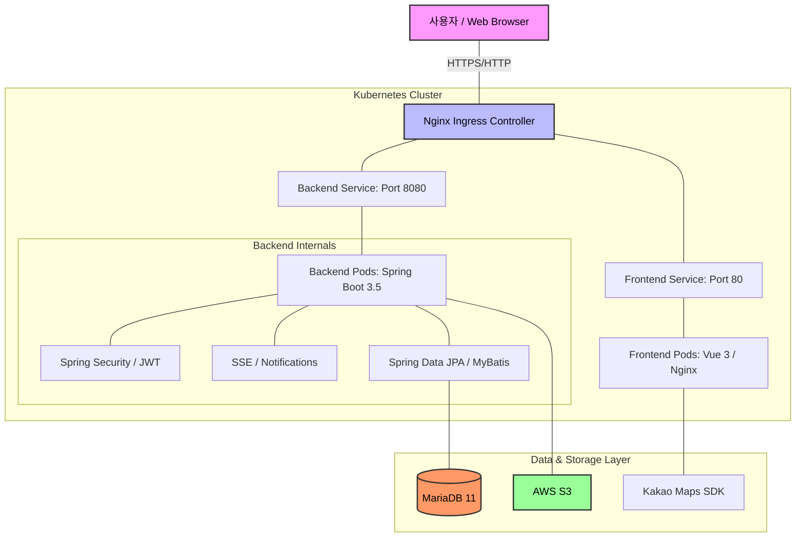
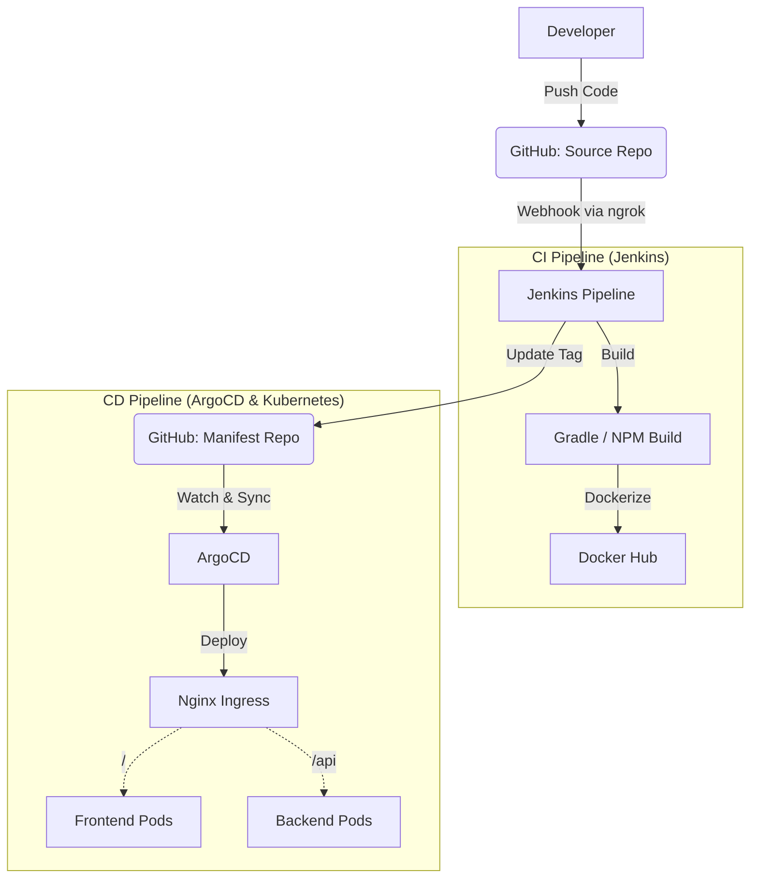

<div align="center">
  
  <h1>📍 MapLog</h1>
  <p><strong>위치 기반 소셜 다이어리 서비스</strong></p>
  <p>방문한 장소를 지도에 마킹하고, 일기를 기록하며 친구들과 실시간으로 공유하세요.</p>
</div>

<br/>

## 👥 2. 팀원 소개 및 역할 분담

**개발 인원:** 4명 | **개발 기간:** 약 2주

| 이름 | 역할 및 담당 도메인 | 주요 기여 내역 |
|:---:|:---|:---|
| **정현호** | Backend / User | • 회원가입/로그인 및 JWT 인증 구현<br>• 관리자 API 구현 |
| **김선일** | Backend / Diary | • 위치 기반 일기 작성 및 조회(CQRS) 구현<br>• AWS S3 이미지 업로드 구현 |
| **정병진** | Backend / Social | • 친구 요청/수락 기능 및 피드 구현<br>• SSE 기반 실시간 알림 시스템 구축 |
| **김태형** | DevOps / Infra | • 공통 예외 처리 및 응답 포맷 구성<br>• Jenkins, ArgoCD, K8s 배포 자동화 파이프라인 구축 |

<br/>

## ✨ 3. 주요 기능 (Key Features)

### 🔐 1. 회원가입 / 로그인 / 로그아웃
JWT 기반 인증으로 안전하게 로그인하고, 계정을 생성하거나 로그아웃할 수 있습니다.


<br/>

### 🗺️ 2. 지도 기반 일기 작성 / 수정 / 삭제
카카오 맵 API를 연동하여 원하는 위치에 일기를 작성합니다. 작성된 일기는 다중 이미지와 함께 저장되며 수정 및 삭제가 가능합니다.


<br/>

### 📍 3. 지도에서 마커로 일기 조회
지도 위에 렌더링된 마커를 클릭하여 해당 위치의 일기를 바로 확인할 수 있습니다. 클러스터링을 통해 다수의 마커를 효율적으로 관리합니다.


<br/>

### 👥 4. 사용자 검색 / 친구 요청 / 수락 / 삭제
이메일 기반으로 다른 사용자를 검색하고 친구 요청을 보낼 수 있습니다. 공개 범위 설정에 따라 친구의 피드에 일기가 공유됩니다.


<br/>

### 🔔 5. 실시간 알림 (SSE)
친구 요청, 수락 등 소셜 인터랙션 발생 시 SSE를 통해 실시간 알림을 수신합니다. 헤더의 종 아이콘을 통해 읽지 않은 알림 개수를 즉각적으로 확인할 수 있습니다.


<br/>

## 🛠 4. 기술 스택 (Tech Stack)

### Frontend


### Backend


### Infrastructure & DevOps


<br/>

## 🏗 5. 시스템 아키텍처 및 CI/CD 파이프라인

MapLog 프로젝트는 서비스 안정성과 확장성을 위해 Kubernetes 환경에 마이크로서비스 아키텍처를 구축했으며, 무중단 배포를 위한 CI/CD 파이프라인을 연동했습니다.

### 5.1 시스템 아키텍처 (System Architecture)



### 5.2 CI/CD 파이프라인 (CI/CD Pipeline)

MapLog 프로젝트는 무중단 자동화 배포를 위해 **GitOps** 기반의 CI/CD 파이프라인을 구축했습니다.



- **CI 과정:** GitHub에 코드가 푸시되면 Webhook과 ngrok 터널링을 통해 Jenkins가 이를 감지하여 프론트엔드 및 백엔드를 빌드하고, 도커 이미지를 Docker Hub에 푸시합니다.
- **CD 과정:** Jenkins가 매니페스트 저장소의 이미지 태그를 업데이트하면, 클러스터 내부의 ArgoCD가 이를 감지(Self-Heal & Prune)하여 Kubernetes에 자동으로 배포합니다.

<br/>

## 💡 6. 핵심 기술 및 트러블슈팅

### 📌 Topic 1. 파일 업로드 아키텍처: 멀티 어댑터 패턴 (Strategy Pattern)
- **상황 (Situation):** 로컬 개발 환경에서는 로컬 파일 시스템(`uploads/`)을 사용해야 하지만, 운영(K8s) 환경에서는 AWS S3 스토리지를 사용해야 했습니다. 인프라 의존성 코드가 비즈니스 로직과 강하게 결합되는 문제가 있었습니다.
- **과제 (Task):** 환경 변화에 따른 코드 수정을 최소화하고, 다형성을 활용하여 스토리지 구현체를 동적으로 교체해야 했습니다.
- **해결 (Action):** `FileStorageService`라는 공통 인터페이스를 정의하고, `@Profile` 어노테이션을 사용하여 `LocalFileStorageService`와 `S3FileStorageService` 구현체를 분리하는 멀티 어댑터 패턴을 적용했습니다.
- **결과 (Result):** `spring.profiles.active` 값(`dev` 또는 `aws`)에 따라 런타임에 적절한 빈(Bean)이 주입되어, 인프라 결합도를 완전히 낮추고 유지보수성을 극대화했습니다.

### 📌 Topic 2. 실시간 기능: SSE (Server-Sent Events) 파이프라인 구축
- **상황 (Situation):** 사용자가 웹사이트를 이용하는 동안 친구 요청 등의 알림을 실시간으로 받아야 했습니다.
- **과제 (Task):** WebSocket은 양방향 통신 기능이 오버엔지니어링이라 판단되었고, 클라이언트가 서버로부터 데이터만 수신하면 되므로 더 가벼운 SSE 도입을 결정했습니다.
- **해결 (Action):** 
  - **Backend:** `SseEmitterService`를 구현하여 `ConcurrentHashMap`으로 사용자별 활성 연결을 스레드 세이프하게 관리했습니다. 30분의 타임아웃을 설정하여 자원 누수를 방지했습니다.
  - **Frontend:** `EventSource` 객체는 HTTP 헤더(Authorization)를 지원하지 않는 한계를 극복하기 위해, 연결 시 JWT 토큰을 쿼리 파라미터(`?token=...`)로 전송하여 백엔드 Security 필터를 통과하도록 구현했습니다.
- **결과 (Result):** 효율적인 단방향 실시간 알림 시스템을 구축하여, 알림 발생 시 프론트엔드의 Pinia 스토어가 이를 감지하고 즉각적으로 반응형 UI를 갱신하게 되었습니다.

<br/>

## 📂 7. 세부 기획 및 문서

프로젝트의 상세한 구조 및 설정 가이드는 `docs/` 디렉터리에 명세되어 있습니다.

- **[시작 가이드 (01-getting-started.md)](docs/introduction/01-getting-started.md):** 로컬 개발 환경(Java 21, Docker MariaDB) 세팅 가이드
- **[백엔드 아키텍처 (03-backend-architecture.md)](docs/introduction/03-backend-architecture.md):** CQRS 패턴 및 다형성을 활용한 파일 스토리지 전략
- **[프론트엔드 아키텍처 (04-frontend-architecture.md)](docs/introduction/04-frontend-architecture.md):** Vue 3, Pinia 상태 관리 및 Axios 자동 토큰 갱신(Refresh Token) 로직
- **[DevOps 및 배포 (02-devops-deployment.md)](docs/introduction/02-devops-deployment.md):** Jenkins CI 및 ArgoCD 기반 CD 파이프라인 명세
- **[SSE 실시간 알림 가이드 (sse-guide.md)](docs/infrastructure/sse-guide.md):** SSE 풀스택 연동 로직
- **[K8s 클러스터 명세 (k8s-architecture.md)](docs/infrastructure/k8s-architecture.md):** 매니페스트 및 Ingress 라우팅 명세

<br/>

## 🚀 8. 설치 및 실행 방법 (Getting Started)

프로젝트를 로컬 환경에서 실행하는 방법입니다. Docker Desktop이 사전 설치되어 있어야 합니다.

### 1) Repository Clone
```bash
git clone https://github.com/20251029-hanhwa-swcamp-22th/be22-4st-team1-project.git
cd be22-4st-team1-project
```

### 2) Database Setup (Docker Compose)
최상위 디렉터리에서 MariaDB 컨테이너를 백그라운드로 실행합니다.
```bash
docker compose up -d
```

### 3) Backend Run
```bash
cd map-log-backend
./gradlew bootRun
```
> 기본 프로필은 `dev`로 설정되어 있어 자동 DDL 생성 및 로컬 파일 스토리지가 활성화됩니다. API 서버는 `http://localhost:8080`에서 동작합니다.

### 4) Frontend Run
새로운 터미널을 열고 프론트엔드를 실행합니다.
```bash
cd map-log-frontend
npm install
npm run dev
```
> 로컬 웹 서버는 `http://localhost:5173`에서 확인할 수 있습니다.
