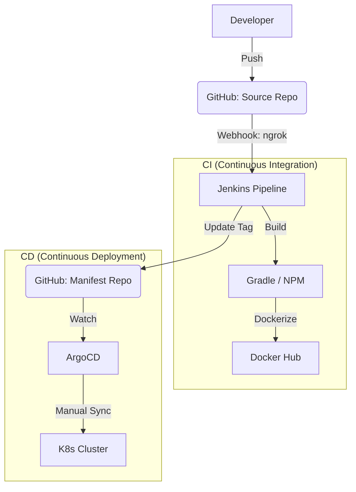

# 02. DevOps & Deployment (데브옵스 및 배포)

이 문서는 MapLog 프로젝트의 CI/CD 파이프라인과 Kubernetes 인프라 구조를 설명합니다.

## 1. CI/CD 파이프라인 아키텍처
MapLog는 Jenkins와 ArgoCD를 결합한 **GitOps** 배포 모델을 따릅니다.



## 2. Jenkins Pipeline (CI)
`Jenkinsfile`에 정의된 파이프라인은 다음 스테이지를 수행합니다.
1. **Checkout:** 소스 코드 및 매니페스트 레포지토리 체크아웃.
2. **Source Build:** Java(Gradle) JAR 생성 및 Vue(Vite) 정적 자산 빌드.
   - *특이사항:* 프론트엔드 빌드 시 Jenkins Credentials에서 카카오 맵 키를 동적으로 주입.
3. **Container Build:** Dockerfile을 이용해 이미지를 생성하고 빌드 번호(`${BUILD_NUMBER}`)로 태깅.
4. **Push:** Docker Hub(`gusgh07`)로 이미지 업로드.
5. **Update Manifest:** `k8s-manifests` 레포지토리의 `deployment.yaml` 내 이미지 태그를 최신화.

## 3. ArgoCD 배포 전략 (CD)
현재 ArgoCD의 Sync Policy는 **Manual(수동)**로 설정되어 있습니다.

### 수동 동기화 선택 이유
1. **검증 가시성:** 인프라 변경 사항(Manifest)이 클러스터에 반영되기 전, ArgoCD UI에서 Diff를 직접 확인하여 배포 안정성을 확보하기 위함입니다.
2. **배포 시점 제어:** 자동 배포 시 발생할 수 있는 의도치 않은 서비스 중단을 방지하고, 개발자가 준비된 시점에 명시적으로 배포를 수행합니다.
3. **학습 및 모니터링:** GitOps 흐름을 단계별로 추적하며 배포 과정의 로그와 상태를 면밀히 관찰하기 위한 전략적 선택입니다.

## 4. 네트워크 및 도메인 배포 (ngrok)
로컬 K8s 환경의 외부 노출 한계를 극복하기 위해 **ngrok**을 활용합니다.
- **Webhook 수신:** GitHub의 Push 이벤트를 Jenkins가 받을 수 있도록 ngrok 터널을 통해 Jenkins 포트를 외부에 노출합니다.
- **서비스 배포:** 현재는 Ingress를 통해 80포트로 서비스를 노출하며, 필요 시 ngrok을 통해 해당 도메인을 퍼블릭 URL로 연동하여 외부에서 접근 가능하게 구성합니다.

## 5. 웹 배포 절차 (Web Deployment)
프로젝트를 실제 웹에 배포하는 표준 절차는 다음과 같습니다.
1. **Ingress 설정:** `ingress.yaml`을 통해 서비스 도메인과 경로를 정의합니다.
2. **ngrok 터널링:**
   ```bash
   ngrok http 80
   ```
   실행 후 생성된 `https://<random>.ngrok-free.app` 주소를 통해 외부 접근이 가능해집니다.
3. **ArgoCD Sync:** Git의 최신 상태와 클러스터 상태를 동기화하여 실배포를 완료합니다.
