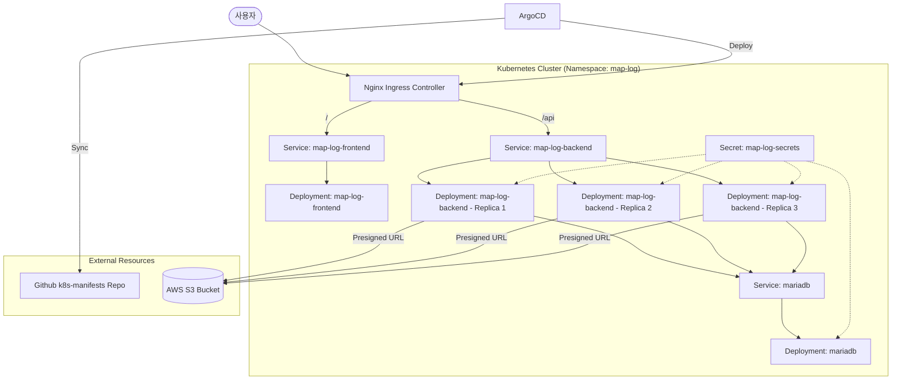

# Kubernetes 클러스터 아키텍처 및 배포 전략

이 문서는 MapLog 서비스가 클라우드 네이티브 환경(Kubernetes)에 배포되는 구조와 ArgoCD를 이용한 GitOps 운영 방식을 설명합니다.

## 1. 아키텍처 다이어그램 (Architecture Overview)
MapLog 서비스는 Ingress Controller를 통해 외부로 노출되며, 내부적으로는 마이크로서비스 형태의 배포 구조를 가집니다.

## 2. 배포 구성 (Deployment Configuration)

### 2.1 Backend (map-log-backend)
- **레플리카:** **3개** (`replicas: 3`) 설정으로 가용성 확보.
- **포트:** 내부 컨테이너 포트 `8080`.
- **환경 변수 주입:** `map-log-secrets` 시크릿을 통해 DB 비밀번호, JWT 시크릿, AWS S3 자격 증명을 동적으로 주입받습니다.
- **프로필:** `SPRING_PROFILES_ACTIVE=dev` 설정을 기본으로 하며, 필요한 경우 운영 환경에서 `aws` 프로필로 전환됩니다.

### 2.2 Frontend (map-log-frontend)
- **레플리카:** **1개** (`replicas: 1`).
- **이미지:** Nginx 기반 정적 자산 서빙.
- **환경 변수:** `VITE_API_BASE_URL=/api` 설정을 통해 Ingress 라우팅과 일치시킵니다.

### 2.3 Database (mariadb)
- **이미지:** `mariadb:11`.
- **설정:** `utf8mb4` 문자셋과 `utf8mb4_unicode_ci` 콜레이션을 기본으로 설정하여 다국어 및 이모지 처리를 지원합니다.

## 3. 네트워크 및 라우팅 (Network & Routing)

### 3.1 Services
각 애플리케이션은 ClusterIP 타입의 서비스를 통해 클러스터 내부 통신을 수행합니다.
- `mariadb`: 3306 포트 노출.
- `map-log-backend`: 8080 포트 노출.
- `map-log-frontend`: 80 포트 노출.

### 3.2 Ingress 라우팅 전략
Nginx Ingress Controller를 사용하여 단일 엔드포인트에서 경로 기반 라우팅을 수행합니다.
- **`/` (Root):** 프론트엔드 서비스(`map-log-frontend`)로 연결.
- **`/api`:** 백엔드 API 서비스(`map-log-backend`)로 연결.
- **Annotation:** `kubernetes.io/ingress.class: nginx` 설정을 통해 Ingress Controller와 연동됩니다.

## 4. GitOps 운영 (ArgoCD)
MapLog 프로젝트는 `argocd-application.yaml` 정의에 따라 자동화된 배포 프로세스를 따릅니다.

- **대상 레포지토리:** `https://github.com/gusgh075/k8s-manifests.git`
- **Sync Policy:**
    - **Automated Sync:** Git 저장소의 매니페스트 변경 시 클러스터에 자동 반영.
    - **Prune:** Git에서 삭제된 리소스를 클러스터에서도 자동 삭제.
    - **Self-Heal:** 클러스터 리소스가 수동으로 변경되었을 때 Git 상태로 자동 복구.
- **Namespace:** 모든 리소스는 `map-log` 네임스페이스 내에서 관리됩니다.

## 5. 보안 설정 (Secret Management)
민감한 설정값은 `map-log-secrets` 시크릿 객체로 관리됩니다.
- **관리 항목:** `DB_PASSWORD`, `JWT_SECRET`, `AMAZON_S3_ACCESS_KEY`, `AMAZON_S3_SECRET_KEY`, `AMAZON_S3_BUCKET_NAME`, `AMAZON_S3_REGION`.
- **운영 원칙:** 실제 시크릿 값은 Git에 노출하지 않으며, 클러스터에 직접 수동으로 적용하거나 Jenkins Credentials를 통해 주입됩니다.
