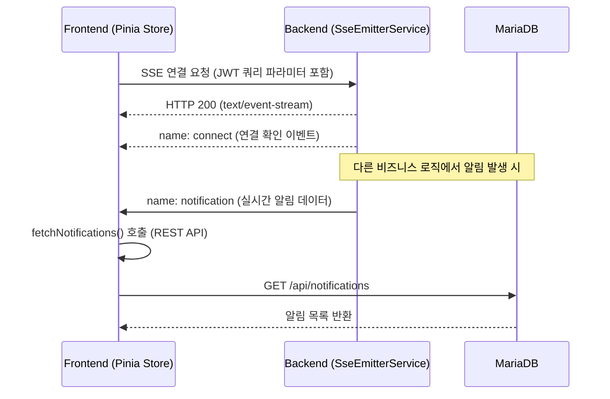

# SSE (Server-Sent Events) 연동 가이드

이 문서는 MapLog의 실시간 알림 시스템을 구현하는 SSE(Server-Sent Events) 기술 스택과 연동 방식을 설명합니다.

## 1. 개요 (Overview)
MapLog는 친구 요청, 수락 등 실시간 이벤트 알림을 위해 SSE 기술을 사용합니다. WebSocket과 달리 SSE는 서버에서 클라이언트로의 단방향 데이터 스트리밍에 최적화되어 있으며, 가벼운 HTTP 프로토콜을 사용합니다.

## 2. 백엔드 구현 (Backend Implementation)
백엔드는 `com.maplog.sse` 패키지에서 SSE 연결 및 이벤트 전송을 관리합니다.

### 2.1 SseEmitterService
사용자별 `SseEmitter` 객체를 관리하는 핵심 서비스입니다.
- **연결 관리:** `ConcurrentHashMap<Long, SseEmitter>`를 사용하여 `userId`와 연결 객체를 매핑합니다.
- **타임아웃:** 연결 유지 시간은 **30분**(`30 * 60 * 1000L`)으로 설정되어 있습니다.
- **생명주기:** `onTimeout`, `onError`, `onCompletion` 콜백을 통해 연결 종료 시 맵에서 객체를 안전하게 제거합니다.
- **초기 이벤트:** 연결 직후 `connect`라는 이름의 더미 이벤트를 전송하여 연결 성공을 알리고 일부 프록시의 버퍼링을 방지합니다.

### 2.2 SseController
클라이언트의 연결 요청을 받는 진입점입니다.
- **Endpoint:** `GET /api/sse/connect`
- **인증:** `@AuthenticationPrincipal`을 통해 현재 로그인된 사용자를 확인합니다.
- **Content-Type:** `text/event-stream`으로 설정되어 브라우저가 SSE 스트림으로 인식하게 합니다.

## 3. 프론트엔드 구현 (Frontend Implementation)
프론트엔드는 Pinia의 `notification` 스토어에서 SSE 연결과 이벤트 수신 로직을 통합 관리합니다.

### 3.1 EventSource 연결 전략
브라우저 표준 API인 `EventSource`를 사용합니다. 
> ⚠️ **인증 문제 해결:** `EventSource`는 HTTP 헤더(Authorization)를 기본적으로 지원하지 않습니다. 이를 해결하기 위해 JWT 토큰을 **쿼리 파라미터(`?token=...`)**로 전달하여 백엔드 보안 필터를 통과하도록 구현되었습니다.

### 3.2 알림 수신 및 UI 갱신
- **notification 이벤트:** 서버에서 알림이 발생하면 `notification` 이름의 이벤트를 수신합니다.
- **자동 갱신:** 이벤트를 받으면 `fetchNotifications()` 함수를 즉시 실행하여 알림 목록을 서버에서 다시 가져와 UI에 반영합니다.
- **의존성 전파:** `friendEventTrigger` 값을 증가시켜 친구 목록 화면(`FriendView`) 등 다른 컴포넌트에서도 실시간 상태 변화를 감지할 수 있도록 설계되었습니다.

## 4. 장애 대응 및 재연결 (Error Handling & Reconnect)
- **자동 재연결:** SSE 연결이 끊어지면(Error 발생 시) 프론트엔드에서 **3초 후** 자동으로 다시 연결을 시도하는 로직이 포함되어 있습니다.
- **메모리 관리:** 백엔드에서는 연결 종료 시 즉시 `emitters` 맵에서 해당 객체를 삭제하여 서버 자원 낭비를 방지합니다.

## 5. 데이터 흐름 (Data Flow)

