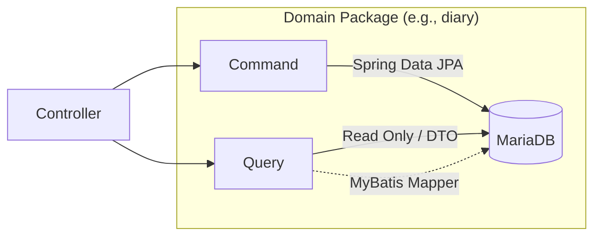
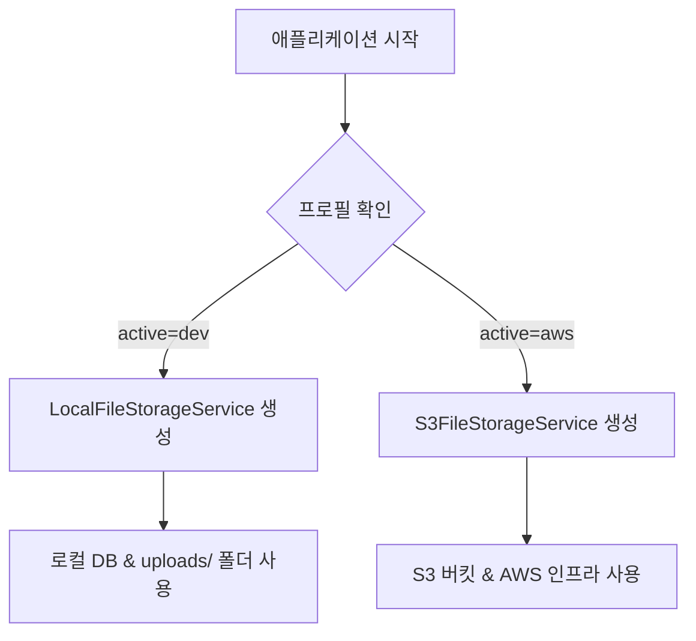

# 03. Backend Architecture (백엔드 아키텍처)

MapLog 백엔드는 Spring Boot 3.5 기반으로 설계되었으며, 도메인 주도 설계(DDD)와 CQRS 패턴을 지향합니다.

## 1. 패키지 구조 및 패턴 (CQRS)
MapLog 백엔드는 비즈니스 로직과 데이터 처리를 효율적으로 관리하기 위해 도메인 기반 패키지 구조를 채택했으며, 각 도메인 내부는 **Command(쓰기)**와 **Query(읽기)**로 명확히 분리되어 있습니다.

- **`com.maplog.diary`**: 일기 작성, 수정, 조회 및 지도 기반 검색.
- **`com.maplog.friend`**: 친구 요청 관리 및 팔로잉 목록.
- **`com.maplog.notification`**: 알림 내역 저장 및 상태 관리.
- **`com.maplog.sse`**: 실시간 알림 전송을 위한 SSE(Server-Sent Events) 연결 관리.
- **`com.maplog.user`**: 회원 가입, 로그인, JWT 인증 및 프로필 관리.
- **`com.maplog.common`**: 전역 예외 처리, 보안 설정 및 스토리지 서비스 등 공통 인프라.

- **Command:** 비즈니스 로직 처리 및 데이터 상태 변경을 담당합니다. JPA를 사용하여 영속성을 보장합니다.
- **Query:** 복잡한 조회와 성능 최적화를 담당합니다. 단순 조회는 JPA를 사용하되, 복잡한 통계나 조인은 MyBatis XML 매퍼를 활용합니다.
- **장점:** 읽기와 쓰기의 모델을 분리함으로써 시스템의 복잡도를 낮추고 각 요청의 특성에 맞는 최적화가 가능합니다.

## 2. 파일 저장 전략 (AWS S3)
이미지 첨부 기능을 위해 AWS S3 인프라를 활용하며, 보안을 위해 **Presigned URL** 방식을 채택했습니다.

### 프로필 기반 자동 환경 구분 및 저장소 선택
Spring Boot의 **`@Profile`** 기능을 활용하여, 서버 실행 환경에 따라 적절한 저장소 구현체(`FileStorageService`)를 자동으로 선택합니다.

- **로컬 환경 (`dev`):** `@Profile("dev")` 설정에 의해 `LocalFileStorageService`가 활성화되며, 별도의 AWS 설정 없이 로컬 파일 시스템(`uploads/`)을 저장소로 사용합니다.
- **AWS/K8s 환경 (`aws`):** `@Profile("aws")` 설정에 의해 `S3FileStorageService`가 활성화됩니다. K8s의 `SPRING_PROFILES_ACTIVE` 환경 변수를 통해 인프라 환경을 자동으로 감지합니다.
- **장점:** 환경별 코드 수정 없이 동일한 인터페이스로 로컬 개발과 클라우드 배포를 동시에 지원하며, 로컬 환경에서 불필요한 AWS 빈 생성으로 인한 의존성 오류를 원천 차단합니다.

### 프로파일 활성화 방법 (Profile Activation)
애플리케이션이 실행될 때 특정 프로파일을 활성화하는 방법은 다음과 같으며, 아래로 갈수록 우선순위가 높습니다.

1. **`application.yml` 설정 (기본값):**
   - 파일 내부의 `spring.profiles.active` 속성을 통해 기본 프로파일을 지정합니다. (현재 프로젝트는 `dev`가 기본값)
2. **Kubernetes 환경 변수 (배포 환경):**
   - `deployment.yaml`의 `env` 설정에서 `SPRING_PROFILES_ACTIVE` 값을 주입합니다.
   - 예: `value: "aws"` 또는 `value: "dev,aws"` (여러 프로파일 동시 활성화 가능)
3. **IDE 설정 및 CLI 옵션 (로컬 테스트):**
   - **IntelliJ:** `Run/Debug Configurations` -> `Active profiles` 칸에 프로파일 명 입력.
   - **CLI:** 실행 시 `-Dspring.profiles.active=aws` 옵션 추가.

### Presigned URL 워크플로우
1. **업로드:** 클라이언트가 파일을 전송하면 서버가 S3에 저장합니다.
2. **조회 요청:** 클라이언트가 이미지 URL을 요청합니다.
3. **URL 생성:** 서버는 AWS SDK를 사용하여 해당 객체에 접근할 수 있는 **임시 서명된 URL**을 생성합니다.
4. **유효 시간:** 보안을 위해 생성된 URL은 **1시간 동안만** 유효하며, 이후에는 접근이 차단됩니다.

## 3. 실시간 알림 아키텍처 (SSE)
사용자 간의 상호작용(친구 요청, 수락 등)을 즉각적으로 전달하기 위해 **SSE(Server-Sent Events)** 기술을 채택했습니다.

- **`SseEmitterService`**: 사용자별 `SseEmitter` 객체를 `ConcurrentHashMap`으로 관리하여 서버 부하를 최소화하며 실시간 연결을 유지합니다.
- **연결 유지 및 Heartbeat**: 30분의 타임아웃을 설정하고, 연결 유지 메시지를 전송하여 네트워크 환경(Proxy, ELB 등)으로 인한 연결 끊김을 방지합니다.
- **인증 우회**: 브라우저 `EventSource` 표준에서 HTTP 헤더 지원이 제한적이므로, 연결 시 쿼리 파라미터로 JWT를 전달받아 `JwtAuthenticationFilter`에서 인증을 처리합니다.

## 4. 공통 인프라 레이어 (Common)
- **Security:** JWT 기반 인증/인가를 수행하며, `JwtAuthenticationFilter`가 모든 요청의 토큰을 검증합니다.
- **Exception Handling:** `GlobalExceptionHandler`를 통해 비즈니스 예외와 시스템 예외를 표준화된 `ApiResponse` 포맷으로 응답합니다.
- **Storage Service:** 인터페이스화를 통해 `dev` 프로필에서는 로컬 저장소를, `aws` 프로필에서는 S3 저장소를 사용하도록 유연하게 설계되었습니다.

## 4. DB 관리
별도의 데이터 마이그레이션 도구(Flyway 등) 대신 **JPA ddl-auto**를 활용하여 엔티티 모델과 데이터베이스 스키마의 일관성을 유지합니다.
- 개발 단계의 민첩성을 확보하기 위해 `update` 모드를 기본으로 사용합니다.
