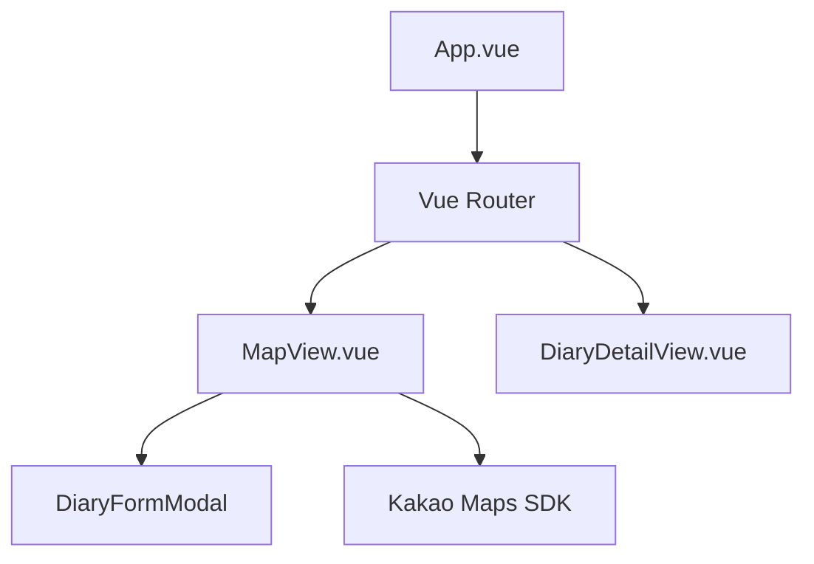

# 04. Frontend Architecture (프론트엔드 아키텍처)

Vue 3 (Composition API) 기반의 프론트엔드 구조와 주요 기술적 구현 사항을 설명합니다.

## 1. 컴포넌트 및 레이아웃 구조
프로젝트는 관심사 분리를 위해 `views`(페이지 단위)와 `components`(재사용 단위)를 구분합니다.

## 2. 상태 관리 (Pinia)
중앙 상태 관리를 위해 Pinia를 사용하며, 각 도메인별 상태를 반응형으로 관리합니다.

- **`auth.js`**: 
  - 사용자 인증 상태(로그인 여부) 및 프로필 정보를 관리합니다.
  - `localStorage`를 통해 토큰(`ml_access_token`, `ml_refresh_token`)을 영속화하여 브라우저 새로고침 후에도 세션을 유지합니다.
  - 로그아웃 시 모든 인증 상태 및 SSE 연결을 초기화합니다.
- **`notification.js`**: 
  - SSE를 통한 실시간 알림 수신을 관리하며, 읽지 않은 알림 개수(Badge)를 반응형 UI에 즉각 반영합니다.
  - `connectSSE()`를 통해 백엔드와 연결하고, `EventSource`로부터 `notification` 이벤트를 수신하여 UI를 즉시 갱신합니다.

## 3. 지도 및 위치 기반 기능
카카오 맵 연동은 별도의 래퍼 라이브러리 없이 **Native SDK를 직접 제어**하는 방식을 채택했습니다.

- **구현 방식:** `MapView.vue`에서 `window.kakao` 객체를 직접 조작하여 지도를 초기화하고 마커를 렌더링합니다.
- **동적 로딩:** 사용자가 지도를 클릭할 때 좌표를 추출하고, 해당 위치에 일기를 작성할 수 있는 모달을 연동합니다.
- **최적화:** 지도 영역 변경(`idle` 이벤트) 시 현재 화면 내의 마커만 서버에서 가져오도록 구현되어 있습니다.

## 4. API 통신 및 토큰 갱신 전략 (Axios)
유지보수 효율을 높이고 사용자 경험을 끊김 없이 유지하기 위해 **Axios 인터셉터** 기반의 보안 계층을 구축했습니다.

- **중앙 제어**: `api/axios.js`에서 공통 `baseURL`과 요청/응답 인터셉터를 관리합니다.
- **자동 토큰 갱신 (Silent Refresh)**: 
  - 응답 인터셉터가 **401(Unauthorized)** 에러를 감지하면, `refreshToken`을 사용하여 자동으로 새 `accessToken`을 발급받습니다.
  - 이 과정은 사용자 모르게 백그라운드에서 진행되어 로그인 세션이 끊기는 경험을 방지합니다.
- **요청 큐 (Request Queueing)**: 토큰이 갱신되는 동안 발생하는 모든 추가 API 요청은 큐(`pendingQueue`)에 저장되었다가, 갱신 성공 후 한꺼번에 재시도됩니다.
- **경로 분리**: 각 도메인 API 파일(`user.js`, `diary.js` 등)에서는 자원 경로만 관리하며 환경 변수 `VITE_API_BASE_URL`과 결합됩니다.
